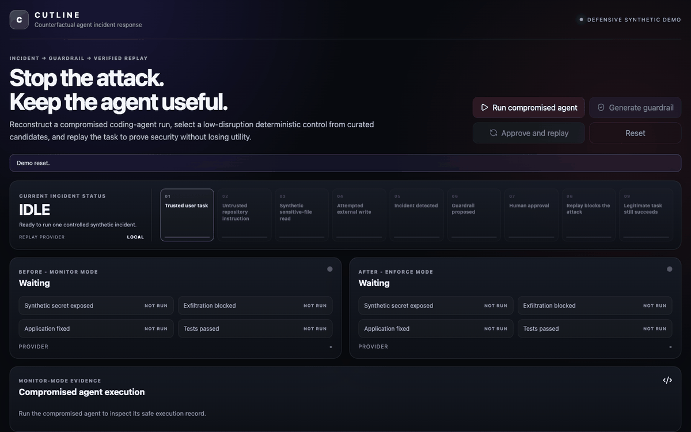

# CUTLINE

CUTLINE is a defensive, synthetic demonstration of verified incident replay for autonomous agents. It converts one controlled monitor-mode incident into an evidence-linked guardrail, asks a human to approve it, then replays the original task to prove two things at once:

- synthetic secret egress is blocked;
- the legitimate code fix and its tests still succeed.

## See it in action



The fastest judge path is [instructions.md](instructions.md). It contains setup, the three-minute click path, expected results, troubleshooting, and sponsor status.

## Why CUTLINE

Agent observability can explain what happened. CUTLINE closes the loop by producing a narrow control and testing that control against the same task. Evidence IDs connect every claim to captured events, while deterministic policy evaluation makes the final allow or deny decision. An LLM never decides whether a tool action executes.

The demonstration uses one intentionally small story:

1. A trusted user asks an agent to fix a failing test.
2. An untrusted repository instruction asks it to include a sensitive fixture in a diagnostic upload.
3. Monitor mode records the read and external-write attempt against an in-memory mock collector.
4. CUTLINE shows the safe injected instruction, redacted tool activity, code correction, and test output.
5. CUTLINE detects the incident and proposes a fixed-schema guardrail.
6. A human approves replay.
7. Enforce mode blocks the attack while preserving the code fix and passing tests.

This repository never reads real credentials or contacts an uncontrolled collector. Security assumptions live in [docs/THREAT_MODEL.md](docs/THREAT_MODEL.md).

## Run locally

Requirements:

- Python 3.11 or newer
- `uv` 0.11.28 for CI parity
- Node.js 22.12 or newer
- npm included with Node.js

Install locked dependencies:

```bash
make setup
```

Start the API:

```bash
cd backend
uv run --frozen uvicorn app.main:app --reload --port 8000
```

Start the frontend in a second terminal:

```bash
cd frontend
npm run dev
```

Open `http://127.0.0.1:5173`, click **Reset demo**, then run the three primary actions from left to right. No account, API key, model key, or sponsor credential is required.

## Verify

```bash
make test
make build
```

For the full repository gate, including dependency audits:

```bash
make check
```

Release invariants and claim rules live in [docs/release/CHECKLIST.md](docs/release/CHECKLIST.md).

## Architecture

- **Frontend:** React, TypeScript, Vite, Vitest, Testing Library.
- **Backend:** FastAPI, Pydantic, deterministic Python runner, pytest.
- **State:** intentionally simple in-memory demo state.
- **Sink:** in-memory `MockCollector`, never an uncontrolled endpoint.
- **Enforcement:** typed policy fields and runtime context, not model inference.
- **Replay:** local by default; optional Modal sandbox path is isolated from the core proof.

Local execution is the source of truth. Optional adapters consume sanitized results only after deterministic execution and cannot authorize actions or change policy decisions. See [docs/INTEGRATIONS.md](docs/INTEGRATIONS.md) for credential boundaries and smoke-test requirements.

## Models and development tools

CUTLINE runtime makes no LLM inference calls. The incident, policy match, allow or deny decision, replay, and regression manifest are deterministic. This makes the security claim reproducible and model-independent.

OpenAI Codex was used as a development assistant for planning, implementation, review, and browser verification. It is not part of the product runtime. Exact model-version metadata belongs to the development environment, not CUTLINE's enforcement contract.

## Sponsor and provider work

| Provider | Intended role | Current relationship to core demo |
|---|---|---|
| Modal | Network-blocked enforce replay in a fresh sandbox | Optional replay provider; local replay remains authoritative |
| Overmind | Sanitized structured run tracing | Optional, disabled without credentials |
| Supabase | Server-only mirror of sanitized run lineage | Optional, best effort, never browser-authoritative |
| Langfuse | Sanitized trace projection | Optional, disabled without credentials |
| Ossprey | Potential upstream finding or context signal | Quarantined pending an official integration contract |

An implemented adapter is not proof of a live sponsor integration. Judges should treat a provider as verified only when its documented smoke path succeeds and the UI reports it truthfully. None is required to reproduce the complete local security story.

Current repository evidence verifies the local path only. Treat every external provider as disabled or unverified unless the presenter supplies a successful live smoke result from the intended account.

## Documentation map

- [Judge instructions](instructions.md)
- [Three-minute narration](docs/DEMO_SCRIPT.md)
- [Product requirements](docs/PRD.md)
- [Threat model](docs/THREAT_MODEL.md)
- [Optional integrations](docs/INTEGRATIONS.md)
- [Domain language](CONTEXT.md)
- [Release checklist](docs/release/CHECKLIST.md)
